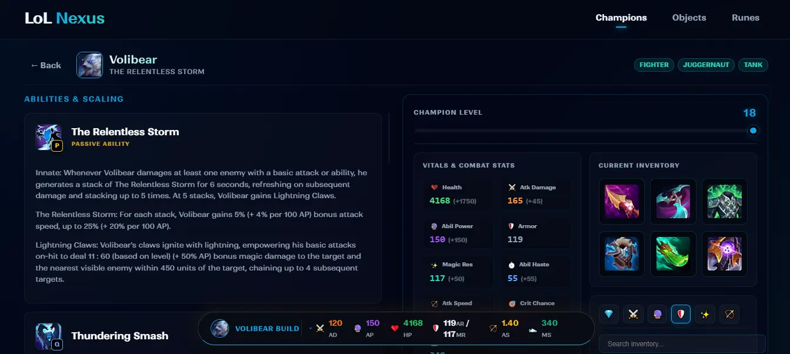
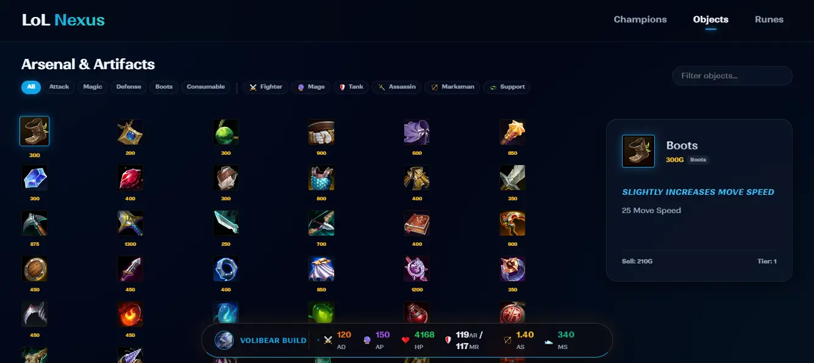
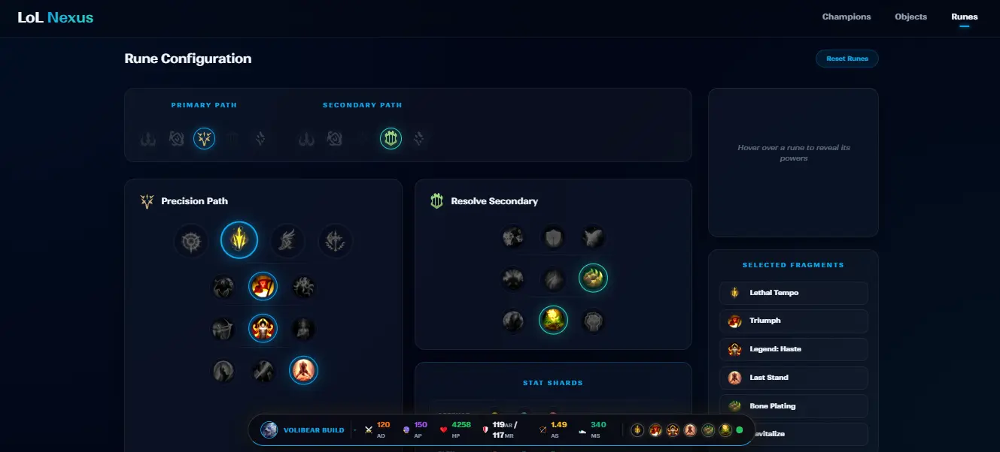

# LoL Nexus 🏆

A modern, high-performance companion application for League of Legends players, built with React and TypeScript. LoL Nexus provides real-time insights into champion builds, item scaling, and game mechanics.

 
 
 

## ✨ Features

- **Champion Database**: Comprehensive list of champions with detailed stay-and-ability info.
- **Dynamic Item Scaling**: Real-time calculation of ability damage and stats based on equipped items.
- **Modern UI/UX**: Smooth animations using Framer Motion and a responsive design.
- **State Management**: Robust application state handled by Zustand.
- **Automated Testing**: Professional QA suite using Playwright to ensure logic accuracy.

## 🛠️ Tech Stack

- **Frontend**: [React 18](https://reactjs.org/) + [TypeScript](https://www.typescriptlang.org/)
- **Build Tool**: [Vite](https://vitejs.dev/)
- **Styling**: Vanilla CSS with modern patterns
- **Animations**: [Framer Motion](https://www.framer.com/motion/)
- **Icons**: [Lucide React](https://lucide.dev/)
- **State Management**: [Zustand](https://github.com/pmndrs/zustand)
- **Testing**: [Playwright](https://playwright.dev/)

## 🚀 Getting Started

### Prerequisites

- [Node.js](https://nodejs.org/) (v18 or higher)
- npm or pnpm

### Installation

1. Clone the repository:
   ```bash
   git clone https://github.com/yourusername/lol-nexus.git
   cd lol-nexus
   ```

2. Install dependencies:
   ```bash
   npm install
   ```

3. Start the development server:
   ```bash
   npm run dev
   ```

### Running Tests

To run the automated test suite:
```bash
npx playwright test
```


*Built by [Levi Oquendo].*
